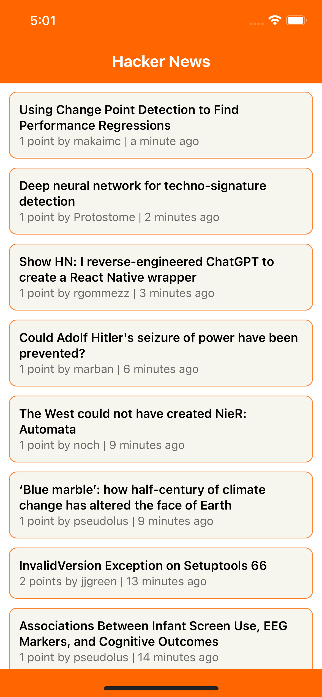
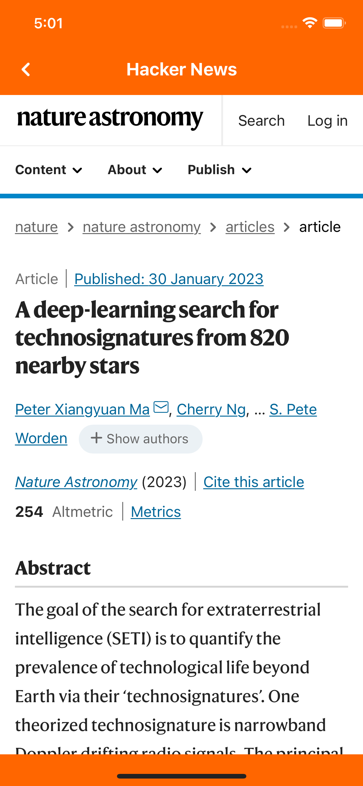

# Hacker News

## Description

Hacker news app made with React Native. This app display new posts list with infinite scroll.

## Prerequisites

- [Node.js > 12](https://nodejs.org) and npm (Recommended: Use [nvm](https://github.com/nvm-sh/nvm))
- [Watchman](https://facebook.github.io/watchman)
- [Xcode 14](https://developer.apple.com/xcode)
- [Cocoapods 1.11.1](https://cocoapods.org)
- [JDK > 11](https://www.oracle.com/java/technologies/javase-jdk11-downloads.html)
- [Android Studio and Android SDK](https://developer.android.com/studio)

## Installation

- Once you have downloaded or cloned this repository, run `yarn install` inside the directory.
- To run app on android, run `yarn android` in project directory.
- To run app on ios, install pods in ios directory run `cd ios && pod install`, then run run `yarn ios` in project directory.

## Base dependencies

- [axios](https://github.com/axios/axios) for networking.
- [react-native-config](https://github.com/luggit/react-native-config) to manage envionments.
- [react-navigation](https://reactnavigation.org/) navigation library.
- [@reduxjs/toolkit](https://github.com/reduxjs/redux-toolkit.git) for state management and dispatch asynchronous actions.
- [react-native-webview](https://github.com/react-native-webview/react-native-webview) to display webview from url.
- [moment](https://github.com/moment/moment) for parsing, validating, manipulating, and formatting dates.

## Project Structure

```
Hacker News
├── __tests__
├── android
├── ios
├── src
│   ├── api
│   ├── assets
│   ├── components
│   ├── constants
│   ├── hooks
│   ├── navigators
│   ├── screens
│   ├── store
│   ├── theme
│   ├── utils
├── .env
├── .gitignore
├── .eslintrc.js
├── .ruby-version
├── .watchmanconfig
├── app.json
├── App.tsx
├── babel.config.js
├── Gemfile
├── index.js
├── tsconfig.json
├── metro.config.js
├── README.md
├── package.json
├── yarn-lock.json
```

## APP Overview

- Home Screen shows new posts having title, posted by, points and time from Hacker API.
- Application is loading 12 items in one request but user can scroll down and see more posts in the list.
- On clicking of any post, user will be redirected to the webview having news url.
- User can also pull down the Home Screen to reload the new posts.

 
